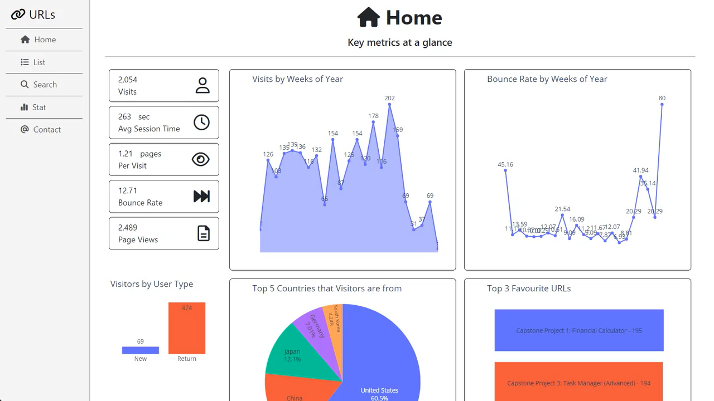
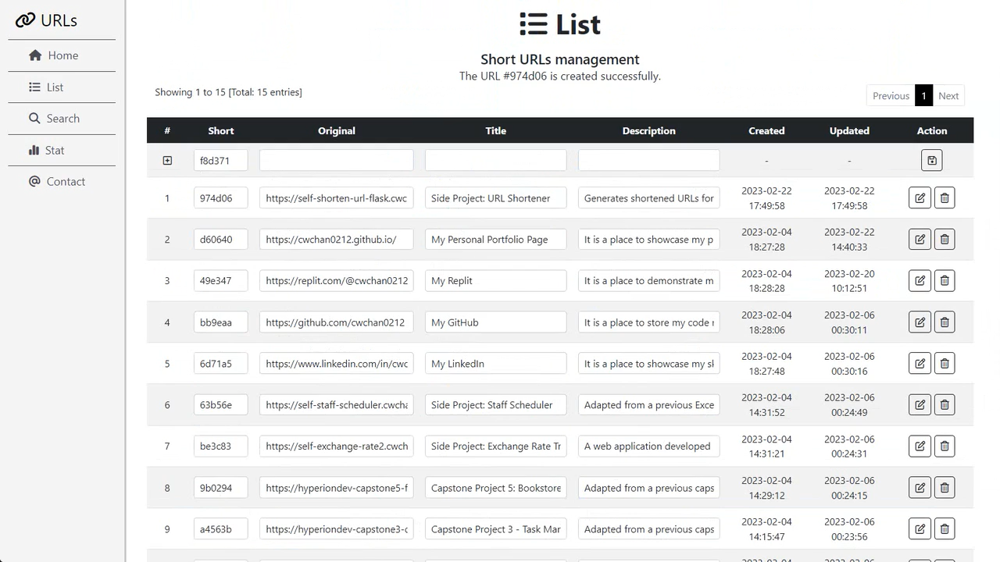
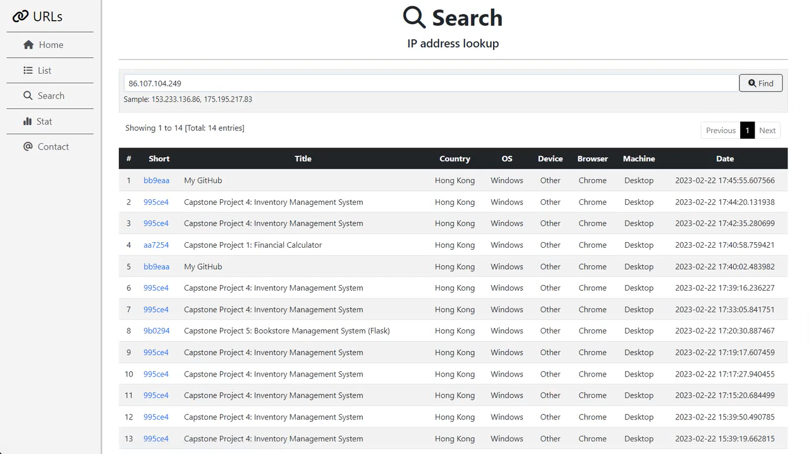
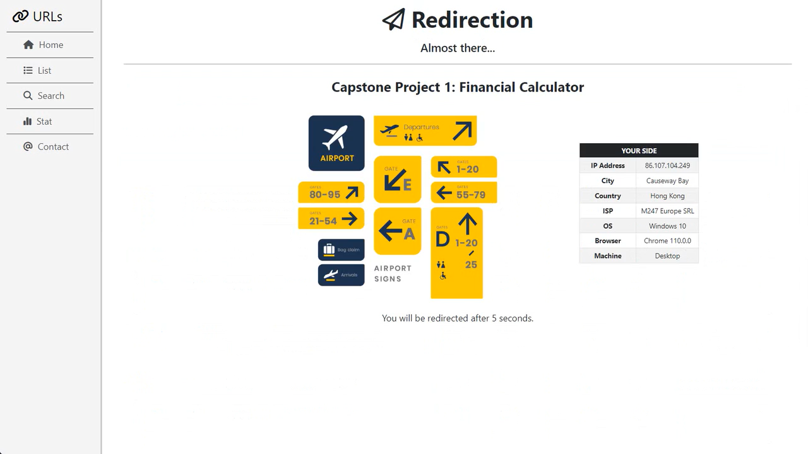
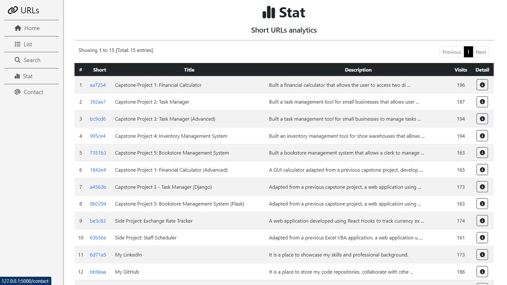
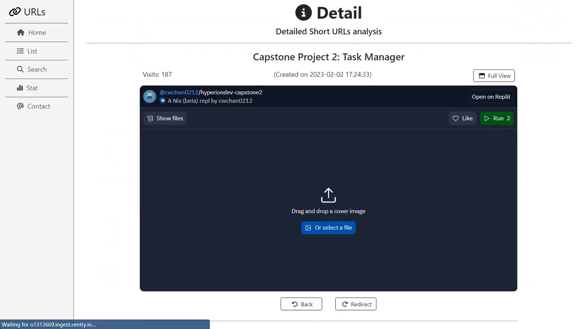
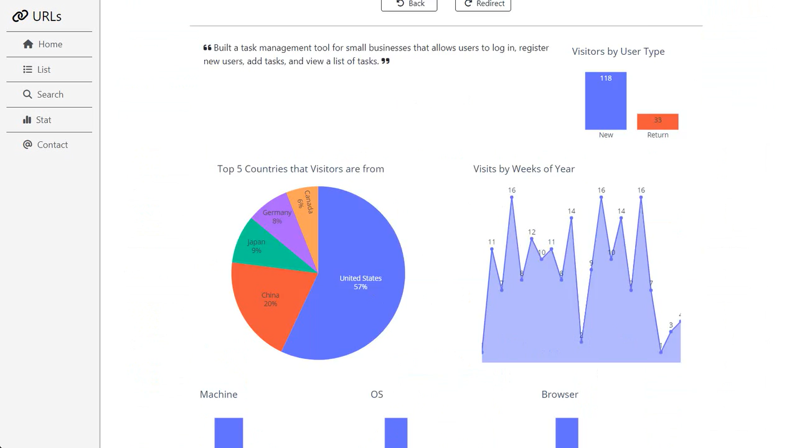
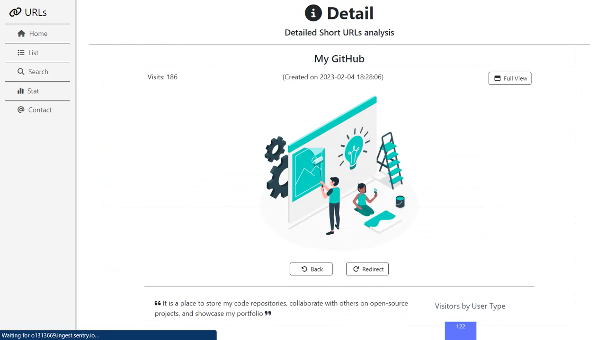

## Side Project - URL Shortener (Flask) 
<a href="https://6gg9.short.gy/zgZzsZ" target="_blank">:arrow_right: Preview</a>  

### Introduction 
This application was built using the **Flask framework** with **PostgreSQL** to a URL shortener.  It generates shortened URLs for users and records the visitor's IP address and user agent. The analytics dashboard features comprehensive metrics and statistics, such as weekly visits, bounce rate, and visitor origin. Users can search for visitors by IP address or user agent and gain detailed insights into their audience. 

<p align="center"><br>
<i>1. The overview of URL Shortener</i></p>

### Getting Started

These instructions will get you a copy of the project up and running on your local machine for development and testing purposes.

###  Prerequisites

- **Python** 3.10 or later
- **Flask** 2.2.0 or later
- Additional packages: 
   - Flask-SQLAlchemy
   - numpy
   - pandas
   - plotly
   - psycopg2
   - python-dotenv
   - requests
   - SQLAlchemy
   - tqdm
   - user-agents
   
 #### Installation

1. **Clone** the repository 
```
git clone https://github.com/cwchan0212/self-url-shortener-flask.git
```
2. **Navigate** to the project directory and copy the files according to the following file structures. 

```
cd url-shortener
```

3. Create a virtual environment in the **venv** folder 
```
py -3 -m venv venv
```

4. **Activate** the environment
```
source venv/bin/activate  # for Linux/macOS
venv\Scripts\activate     # for Windows

```
> Note: Type **deactivate** to exit venv mode

5. Install **Flask**
```
pip install Flask
```

6. Install the necessary packages:
```
pip install Flask-SQLAlchemy
pip install numpy
pip install pandas
pip install plotly
pip install psycopg2
pip install python-dotenv
pip install requests
pip install SQLAlchemy
pip install tqdm
pip install user-agents
```

Alternatively, the user can install the packages on the file  requirements.txt 
```
pip install -r requirements.txt
```

7. Set **environment variables** in the **.env** and **.flaskenv** configuration file.

.env
```
FLASK_SECRET_KEY=yoursecretkey
FLASK_DB_HOST=
FLASK_DB_USERNAME=
FLASK_DB_PASSWORD=
FLASK_DB_URL=
FLASK_DB_API_KEY=
FLASK_SQLALCHEMY_DATABASE_URI=
FLASK_SQLALCHEMY_TRACK_MODIFICATIONS=True
FLASK_SQLALCHEMY_RECORD_QUERIES=False
FLASK_SQLALCHEMY_TRACK_MODIFICATIONS=False
FLASK_SQLALCHEMY_ECHO=False
FLASK_FOOTBALL_API_KEY

```
.flaskenv
```
FLASK_APP=url_shortener
FLASK_ENV=development
FLASK_DEBUG=True
FLASK_RUN_HOST=0.0.0.0
FLASK_RUN_PORT=5000
FLASK_SESSION_COOKIE_HTTPONLY=True
FLASK_REMEMBER_COOKIE_HTTPONLY=True
FLASK_SESSION_COOKIE_SAMESITE=Strict
FLASK_PERMANENT_SESSION_LIFETIME=30
FLASK_MAX_CONTENT_LENGTH=5
```

8. **Start** development server

Normally, the Flask server can be started by the following command:
```
flask --app appName run
```
Set the server **visible externally**
```
flask --app appName run --host=0.0.0.0
```
set **debug** mode **on**
```
flask --app appName --debug run  --host=0.0.0.0
```

After installing **python-dotenv** and configuring **.env** and **.flashenv**, the user can type the following command to start the server.

```
flask run
```
Or simply use the following command to start the server:

run.py
```
from url_shortener import app

if __name__ == "__main__":
    app.run(
        debug=True,
        host="0.0.0.0",
        port=3000,
    )

```

For Windows, type
```
$env:FLASK_ENV=development
$env:FLASK_APP=url_shortener
python run.py
```

For Mac OS, type
```
EXPORT FLASK_ENV=development
EXPORT FLASK_APP=url_shortener
python run.py
```

### File Structure
```
url_shortener/
├─ static/
│  ├─ css/
│  │  ├─ style.css
│  ├─ img/
│  │  ├─ contact.jpg
│  │  ├─ redirect.png
│  │  ├─ redirection.png
├─ templates/
│  ├─ public/
│  │  ├─ base.html
│  │  ├─ contact.html
│  │  ├─ dashboard.html
│  │  ├─ detail.html
│  │  ├─ list.html
│  │  ├─ redirect.html
│  │  ├─ search.html
│  │  ├─ statistics.html
├─ data.py
├─ data_visitor.py
├─ models.py
├─ views.py
├─ __init__.py
.env
.flaskenv
config.py
README.md
requirements.txt
run.py
```

### Usage

1. Starting the development server: You can do this by running the command **flask run** in the terminal.

2. Opening a web browser and navigating to **http://127.0.0.1:5000/**. This will allow you to access the application on your local machine.

3. Use the dashboard, list, search, and statistics features to analyze the short URL data and manage the URLs as needed.

4. Contact the developer via Email, LinkedIn and GitHub to provide feedback or ask for assistance.

### Features

#### Dashboard
The dashboard provides users with a comprehensive view of their URL shortener data. The following metrics and statistics are displayed:
- Number of clicks per URL
- Most popular URLs
- Average time spent on a page
- Weekly visits
- Bounce rate per week
- Number of first and return visitors
- Countries that visitors are from
- Operating system (OS), Browser and Machine used by visitors

#### List
The list feature allows authorised users to perform CRUD operations on their short URLs. 

<p align="center"><br>
<i>2. List - Short URLs management (CRUD operations)</i></p>

> Note: It is not released to the public.

#### Search
The search feature allows users to search for visitors by IP address. Additional search options, such as searching by user agent or by date, can also be added.

<p align="center"><br>
<i>3. Search - IP address lookup</i></p>

<p align="center"><br>
<i>4. Search - Click "Short" URL for redirection</i></p>

#### Statistics
The statistics feature provides users with detailed insights into their audience. The following statistics are displayed:

- Basic information of the URLs
- Number of visits
- Weekly visits
- Bounce rate per week
- Number of first and return visitors
- Countries that visitors are from
- Machine, Operating system (OS) and Browser  used by visitors

<p align="center"><br>
<i>5. Statistics - Short URLs analytics</i></p>

Users can view detailed statistics of each short URL, and when a visitor clicks the redirect button to the redirection page, their info (IP address and user agent) is automatically stored in the database.

<p align="center"><br>
<i>6. Statistics - Detail of Short URLs analytics (1)</i></p>

<p align="center"><br>
<i>7. Statistics - Detail of Short URLs analytics (2) </i></p>

<p align="center"><br>
<i>8. Statistics - Detail of Short URLs analytics (3) </i></p>

#### Contact
To contact the developer for feedback or support via Email, LinkedIn or GitHub.

<p align="center"><br>
<i>9. Contact - Let's connect!</i></p>

### Known Issue
The speed of loading the Dashboard and Statistics pages is relatively slow due to loading the data frame from query record sets and plotting the graphs.

#### Solution
To address the slow loading speed, the Flask Cache is adopted to cache the data frame and graph for a certain amount of time. The flask_caching module is used to implement caching as follows:

```python
from flask_caching import Cache

cache = Cache(config={"CACHE_TYPE": "simple"})
@cache.cached(timeout=300)
```

This solution may not be perfect, but it's an attempt to improve the loading speed.

If you have any possible solution or suggestion to improve the loading speed of the Dashboard and Statistics, please feel free to contact me or create a pull request on the GitHub repository. Your contributions are highly appreciated.

### Acknowledgements
This project was made possible with the help of the following resources:
- <a href="https://ip-api.com/">ip-api.com</a> for providing the API used for looking up IP addresses.
- <a href="https://www.browserling.com/tools/random-ip">browserling</a> for generating random IP addresses used in testing.
- <a href="https://deviceatlas.com/">DeviceAltas</a> for referencing the user agents of the browsers used by visitors. 


   
   


